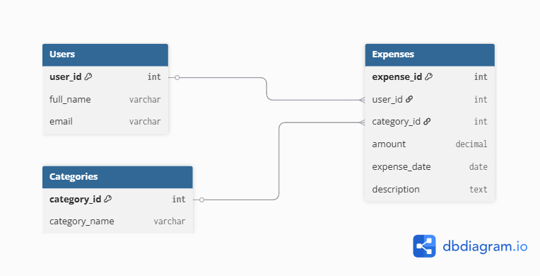

# 💰 Personal Expense Tracker Database

A robust SQL-based backend for a personal finance management system. This project demonstrates database design, normalization, and complex querying.

## 🚀 Overview
This repository contains the database schema and sample queries for an expense tracking application. It allows users to log expenses, categorize them, and generate insightful reports.

## 🛠 Database Schema
The database consists of three main tables:
- **Users**: Stores user profile information.
- **Categories**: Stores expense types (Food, Transport, etc.).
- **Expenses**: Records all financial transactions linked to users and categories.

### Entity Relationship (ER) Diagram

## 📊 Key Features & Queries
The project includes pre-written SQL queries to:
- Retrieve detailed expense reports using **JOINs**.
- Calculate total spending per category using **GROUP BY**.
- Filter and sort transactions by date and amount.

## 📁 Project Structure
- `database_setup.sql`: Schema definitions (DDL).
- `sample_data.sql`: Initial data for testing (DML).
- `queries.sql`: Analytical queries for reporting.

## 🚀 Future Roadmap
- [ ] Implement a REST API using Node.js/Express or Java Spring Boot.
- [ ] Build a Frontend dashboard using React.js.
- [ ] Integrate JWT-based authentication for Users.
- [ ] Deploy the database schema to a Cloud platform.

---
*Developed as part of my Database Learning Journey.*
